<picture>
  <source media="(prefers-color-scheme: dark)" srcset="./assets/hero-dark.svg">
  <source media="(prefers-color-scheme: light)" srcset="./assets/hero-light.svg">
  
</picture>

  <a href="https://yusuke-hayashi.com/">Portfolio</a>
  ·
  <a href="https://haya-inc.co.jp/">Haya Inc.</a>
  ·
  <a href="https://zenn.dev/yhay81">Zenn</a>
  ·
  <a href="https://www.linkedin.com/in/yhay81/">LinkedIn</a>
  ·
  <a href="mailto:yusuke8h@gmail.com">Email</a>

  <strong>Software engineer × product builder, based in Tokyo.</strong> 
  I turn ambiguous problems into production systems—architecture, implementation, evaluation, delivery, and operation.

<table>
  <tr>
    <td width="33%">
      <strong>01 / AI SYSTEMS</strong>  
      LLM integration, RAG pipelines, evaluation, and human-in-the-loop workflows designed for production constraints.
        <code>LLM</code> <code>RAG</code> <code>EVALS</code>
    </td>
    <td width="33%">
      <strong>02 / SYSTEMS &amp; TOOLING</strong>  
      Small, dependable developer tools with clear APIs, native performance, and low operational cost.
        <code>PYTHON</code> <code>RUST</code> <code>APIs</code>
    </td>
    <td width="33%">
      <strong>03 / DELIVERY</strong>  
      Cloud architecture, CI/CD, observability, and team practices that carry software safely into operation.
        <code>CLOUD</code> <code>CI/CD</code> <code>OPS</code>
    </td>
  </tr>
</table>

## Proof of work

<!-- profile:repositories:start -->
| Project | Engineering signal | Live OSS telemetry |
|:--|:--|:--|
| **[pylopdf](https://github.com/yhay81/pylopdf)** | Python ergonomics over a Rust PDF core; small wheels and zero runtime dependencies. | `★ 2` `forks 0` · Python / Rust |
| **[GASlacker](https://github.com/yhay81/GASlacker)** | A production-minded Slack Web API client: 168 methods, rate-limit retries, uploads, and OAuth v2. | `★ 30` `forks 10` · TypeScript / GAS |
| **[public-data-catalog](https://github.com/yhay81/public-data-catalog)** | AI-friendly public API and dataset metadata, published in machine-readable form. | `★ 0` `forks 0` · Python / Data |
<!-- profile:repositories:end -->

> **Current operating loop** · frame the problem → model the system → ship a thin slice → measure reality → harden what matters

At [Haya Inc.](https://haya-inc.co.jp/), I work on production AI adoption and the engineering systems around it—from technical framing through rollout and team enablement.

## Engineering footprint

  

First-party public GitHub signals, regenerated daily with a versioned API and no coding-time vanity metrics.

## Latest writing

<!-- BLOG-POST-LIST:START -->
- [候補者の状態から逆算する、ベンチャーのエンジニア採用チャネル設計](https://zenn.dev/yhay81/articles/202601-venture-engineer-hiring-channels) — 2026-07-25
- [Sigstore入門：どこで使われ、どう使えるのか](https://zenn.dev/yhay81/articles/202607-sigstore-guide) — 2026-07-24
- [Google Apps Script向けSlack APIクライアントOSS「GASlacker」を作り直した](https://zenn.dev/yhay81/articles/202607-google-form-slack) — 2026-07-22
<!-- BLOG-POST-LIST:END -->

---

Outside work, I am usually on a road bike. For consulting, product engineering, or AI adoption inquiries, visit <a href="https://haya-inc.co.jp/">Haya Inc.</a> or <a href="mailto:yusuke8h@gmail.com">get in touch</a>.
